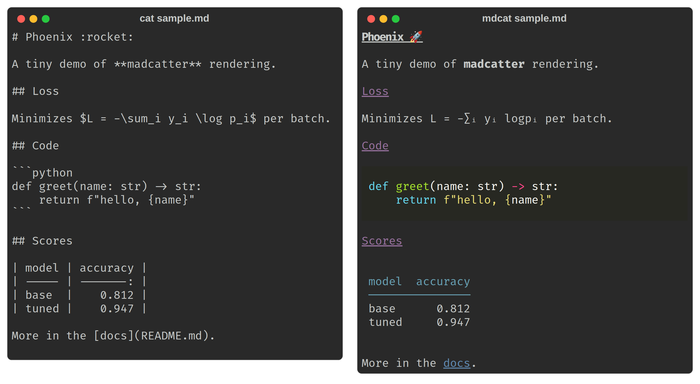

# madcatter

[](https://pypi.org/project/madcatter/)
[](https://github.com/rekursiv-ai/madcatter/actions/workflows/package-validation.yml)
[](LICENSE)
[](pyproject.toml)

`madcatter` is a [Rich](https://github.com/Textualize/rich)-based Markdown renderer for the
terminal. It exists because `cat`-ing a Markdown file dumps raw `#`/`**`/`` ``` `` noise, and most
"pretty cat" tools stop at syntax highlighting: `madcatter` also expands `:shortcode:` emoji,
converts LaTeX math to Unicode, extracts a table of contents or a single section, validates links,
diffs two documents, and can tail a growing file the way `tail -F` tails a log. The package is
called `madcatter`; it installs a CLI called `mdcat`.

> *If you like reading Markdown in the terminal and want it actually rendered — emoji, math,
> tables, syntax highlighting — instead of dumped raw.*



The same file ([`docs/assets/sample.md`](docs/assets/sample.md)), dumped raw with `cat` (left)
and rendered by `mdcat` (right): an emoji shortcode, `$...$` math, a highlighted code block, and
a table.

## Install

```bash
pip install madcatter
```

```bash
uv add madcatter
```

To get just the `mdcat` command on your `PATH` without adding it to a project's dependencies, use
`uv tool install madcatter` (the recommended way to install the CLI).

## Quickstart

```bash
mdcat README.md                       # render a file
mdcat -                               # render stdin
echo '# hi :wave:' | mdcat -          # emoji shortcodes are expanded
mdcat --toc README.md                 # render just the table of contents
```

## Features

- Left-justified headings (Rich's default `Markdown` centers them; `madcatter` doesn't).
- `:shortcode:` emoji expansion, skipped inside fenced/indented code.
- LaTeX-to-Unicode math for `$...$` and `$$...$$`, also skipped inside code.
- Syntax-highlighted fenced code blocks via Pygments themes, plus a code-only extraction mode.
- Table-of-contents rendering and single-section extraction by heading name.
- Link extraction and live link validation (HTTP HEAD checks).
- Unified diff rendering between two Markdown files.
- `--watch` (re-render on change) and `--follow`/`-f`/`-F` (`tail -F` semantics: emit only new
  lines, survive atomic rewrites).
- ASCII-only, HTML, and ANSI export.
- YAML frontmatter stripping.

## Usage cookbook

All examples below use real `mdcat` flags; run `mdcat --help` for the complete list.

**Basic render**

```bash
mdcat README.md              # render a file
mdcat -                      # render stdin
mdcat a.md b.md --separator  # render several files, with a rule between them
```

**Style profiles** (`--style`, one of `dark`, `light`, `dracula`, `solarized`)

```bash
mdcat --style dracula doc.md
```

**Table of contents**

```bash
mdcat --toc README.md
```

**Single section by heading name**

```bash
mdcat --section Install README.md
```

**Links: list or validate**

```bash
mdcat --links README.md         # list every URL found in the document
mdcat --check-links README.md   # also issue a live HTTP HEAD request to each http(s) link
```

**Code blocks only**, optionally filtered by language (`--code-lang` implies `--code-only`)

```bash
mdcat --code-only README.md
mdcat --code-lang python README.md
```

**Diff two Markdown files**

```bash
mdcat old.md --diff new.md
```

**Watch vs. follow** — both require a single real file path (stdin `-` is rejected), and the two
are mutually exclusive with each other:

```bash
mdcat --watch notes.md   # re-render the whole file whenever its mtime changes
mdcat -f log.md          # tail -F semantics: emit only new lines, re-anchor across rewrites
mdcat -n 20 -f log.md    # on first attach/reopen, show only the last 20 lines
```

**Export**

```bash
mdcat --export-html out.html README.md
mdcat --export-ansi out.ans README.md
```

**ASCII-only output** (no ANSI codes, no Unicode — box-drawing, bullets, arrows, etc. are
transliterated)

```bash
mdcat --ascii README.md
```

**Strip YAML frontmatter** before rendering — useful for notes that start with a `---` metadata
block

```bash
mdcat --no-frontmatter note-with-frontmatter.md
```

## Library

The preprocessing helpers are importable directly:

```python
from madcatter.markdown import process_math_blocks, strip_frontmatter
from madcatter.latex import latex2unicode
from madcatter.emoji import resolve

process_math_blocks("area is $\\pi r^2$")   # -> unicode-rendered math, code blocks left intact
strip_frontmatter(["---", "title: x", "---", "body"])  # -> ["body"]
latex2unicode("x^2 + y_i")                  # -> "x² + yᵢ"
resolve("wave")                             # -> "👋" (or None if unknown)
```

## Development

Requires Python 3.12 and [uv](https://docs.astral.sh/uv/).

```bash
uv sync --all-groups
uv run pytest
```

Tests are organized into tiers via `pytest` markers (see `pyproject.toml`). The default run
(`uv run pytest`) excludes the slower/networked tiers — `ci_smoke`, `cuda`, `integration`,
`performance`, `cluster`, and `slow` — so opt in explicitly when needed, e.g.:

```bash
uv run pytest -m ci_smoke        # package/CLI smoke tests
uv run pytest -m integration     # tests needing networking or external CLIs
```

Before opening a pull request, run the same checks CI runs in `package-validation.yml`:

```bash
uv run ruff check --no-fix --no-cache .
uv run ruff format --check --no-cache .
uv run codespell .
uv run ty check
uv run basedpyright madcatter
uv run pytest
uv build
```

## See also

Sibling libraries in the [rekursiv-ai](https://github.com/rekursiv-ai) family:

- [sagent](https://github.com/rekursiv-ai/sagent) — The self-mutating multi-provider coding-agent CLI and typed Python library.
- [trackinizer](https://github.com/rekursiv-ai/trackinizer) — Centralized agent database for tracking inquiries, work, and the evidence behind conclusions.
- [wesearch](https://github.com/rekursiv-ai/wesearch) — Web search, resilient page fetch, and scholarly-paper lookup without a browser stack.
- [priml](https://github.com/rekursiv-ai/priml) — Composable PyTorch building blocks: models, optimizers, losses, and a step-based training loop.
- [configgle](https://github.com/rekursiv-ai/configgle) — Hierarchical experiment configuration in typed pure-Python dataclasses instead of YAML.

## License

Apache License 2.0

